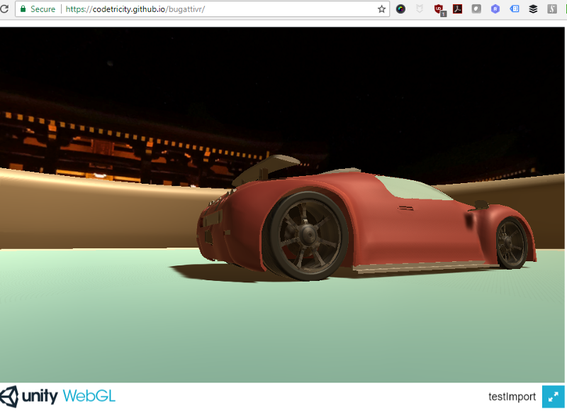
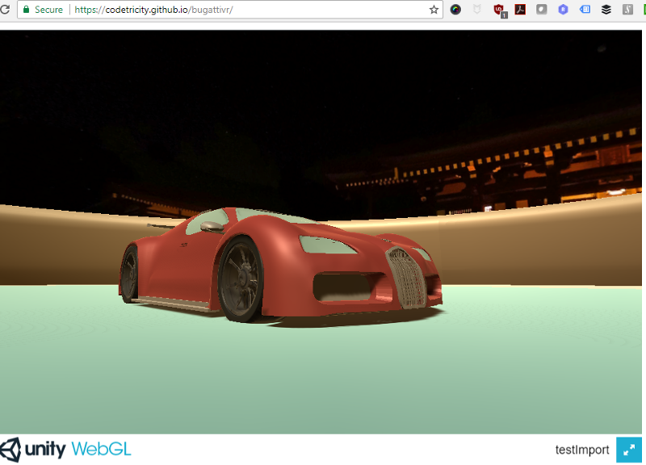
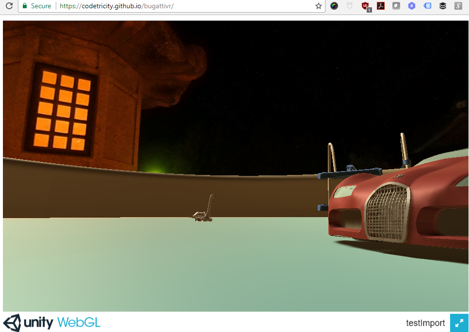

# Test of WebGL with RICOH THETA Images
Made with Unity.

Click on link below, then click on scene to activate focus.

- Movement: WASD or cursor keys on keyboard
- View: mouse
- Exit: ESC key 

## Example
[https://codetricity.github.io/bugattivr/](https://codetricity.github.io/bugattivr/)

## Screenshots

